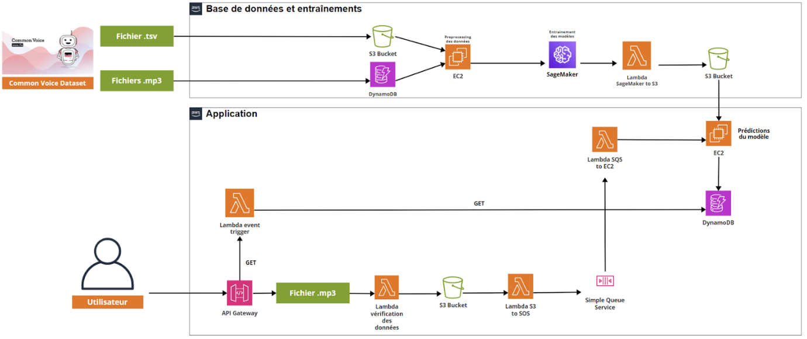

# Architecture Cloud IA

Présentation de l'architecture Cloud liée au PFE réalisé par **HANIFI Léo**, **CORNILLEAU Axel** et **DEBBAGH Ismaël**. 

# Introduction 

Nous allons ci-dessous présenter l’architecture Cloud liée à notre projet de fin d’études. Dans cette architecture Cloud, nous allons utiliser divers services Cloud d’AWS. Notre projet consiste à créer une application qui permet à un utilisateur de soumettre un enregistrement audio de la voix d’une personne et d’avoir une prédiction sur l’âge et le genre de la personne qui parle de l’audio.

Nous avons divisé le projet en deux parties :
- Une première partie appelée **« base de données et entraînements »** dans laquelle nous allons tout d’abord traiter la base de données Common Voice de Mozilla qui contient des audios sous le format mp3 ainsi qu’un fichier « .tsv » dans lequel il y a les informations liées à chaque audio (âge, genre, durée, nationalité, accent …). Dans cette partie nous allons aussi entraîner des modèles de réseaux de neurones qui auront pour but de prédire l’âge et le genre d’une personne en se basant sur un audio de sa voix.
- Une seconde partie appelée **« application »** dans laquelle nous allons créer l’application finale en utilisant les modèles de réseaux de neurones que nous aurons préalablement entraînés pour prédire l’âge et le genre des personnes qui parlent dans les audios soumis par les utilisateurs.

Voici ci-dessous le schéma représentant notre architecture Cloud :

# Première Partie : Base de données et entraînements

L’architecture cloud liée à la première partie contient différents services AWS. Pour chacun de ces services, nous allons détailler ci-dessous son utilité ainsi que pourquoi nous l’avons choisi : 
- **Un Amazon Bucket S3** : Ce Bucket S3 est utilisé pour stocker les fichiers MP3 de la base de données Common Voice ;
- **Une Amazon DynamoDB** : Cette DynamoDB est utilisée pour stocker les métadonnées associées aux fichiers audio (âge, genre, nationalité, type d'accent …). Elle permet des requêtes rapides sur ces métadonnée tout en conservant la flexibilité de la modélisation des données ;
- **Un Amazon EC2** : Cette instance d’EC2 servira à effectuer le prétraitement des fichiers audio en exécutant nos scripts Python liés au préprocessing des données ;
- **Amazon SageMaker** : Nous allons utiliser une instance de SageMaker pour l'entraînement de nos modèles de réseaux de neurones. Cette plateforme proposée par AWS facilite l'entraînement des modèles de Machine Learning à grande échelle, gérant les aspects comme la gestion des ressources, le déploiement des modèles et l'optimisation des hyperparamètres. Les données qui auront été préalablement prétraitées seront utilisées comme entrées pour l'entraînement des modèles. Nous devrons ensuite spécifier les hyperparamètres du modèle, l'algorithme d'apprentissage et d'autres configurations d'entraînement dans SageMaker pour lancer les différents entraînements. SageMaker générera ensuite des modèles de réseaux de neurones entraînés après l'optimisation et l'entraînement sur les données spécifiées ;
- **Un Bucket S3** : Cette instance nous permettra de stocker les modèles de réseaux de neurones au format h5 après qu’ils aient été entraînés grâce à SageMaker ;
- **Une AWS Lambda** appelée « Lambda SageMaker to S3 » : Cette Lambda nous permettra d’automatiser le stockage des modèles de réseaux de neurones entraînés dans le Bucket S3. Lorsqu’un modèle aura fini d’être entraîné grâce à SageMaker, il sera directement et automatiquement stocké dans le Bucket S3 grâce à cette fonction Lambda.

# Deuxième Partie : Application
